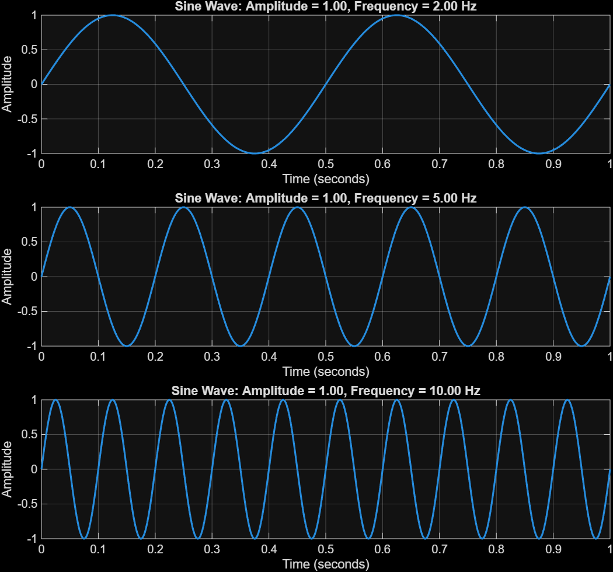
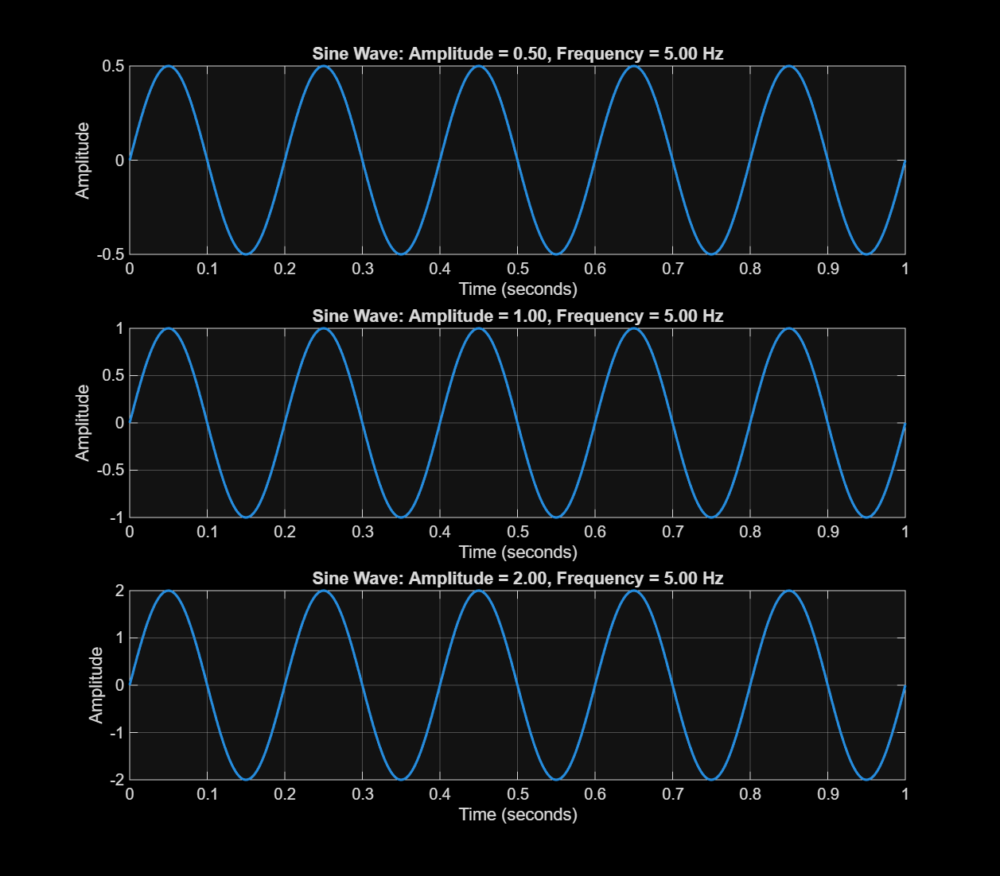
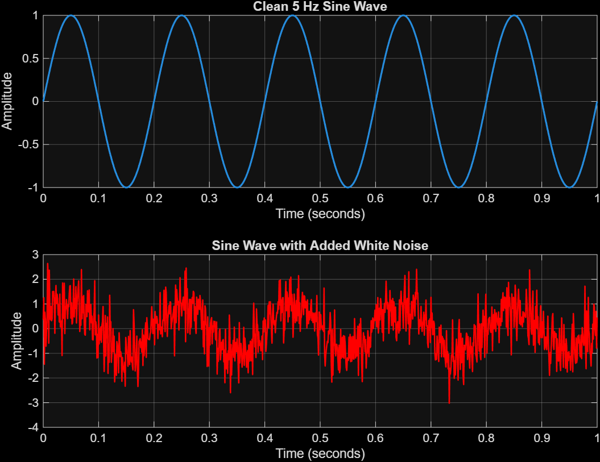

# Signal Comparisons

## Frequency Comparison

1. **Which signal changes fastest?** 
    - The 10 Hz signal changes the fastest, since it completes the most cycles in selected amout of time.

2. **Which signal has the lowest frequency?** 
    - The 2 Hz signal has the lowest frequency.

3. **How can you see the difference in the plots?** 
    - Compare how many cycles each signal completes over the selected amout of time. More cycles = a higher frequency.

## Amplitude Comparison

1. **Which signal has the largest amplitude?** 
    - The signal with amplitude 2 has the largest amplitude.

2. **Does changing amplitude change frequency?** 
    - Amplitude changes the height of the wave, while frequency how many cycles occur over time.

3. **Give one real-world example where amplitude is important.** 
    - Sound volume is related to the amplitude of a sound wave: a larger amplitude is generally heard as a louder sound.

## Clean and Noisy Signal

1. **What changed after adding noise?** 
    - The smooth sine wave became distorted, with random fluctuations around its original shape.

2. **Can you still recognize the original signal?** 
    - Yes. You can see the wave pattern dispite the noise.

3. **Give one real-world source of signal noise.** 
    - Electrical interference from nearby devices can add noise, such as in measurements done with drones.

 

## AI usage
**AI Tool Used:**
    - Google Gemini 3.6 Flash

 **Prompt:**
    - 

    fs = 1000;              % Sampling frequency
    t = 0:1/fs:1;           % Time vector (1 second duration)

    % Define arrays for 3 amplitudes and 3 frequencies
    amplitudes = [0.50, 1, 2];
    frequencies = [2, 5, 10]; 

    % Generate the sine wave
    y = amplitudes(i) * sin(2 * pi * frequencies(i) * t);

    % Plot the signal
    plot(t, y, 'LineWidth', 1.5);

    Create a for loop to subplot 3 value pairs, add formating with %.2f

 **What AI Suggested:**
    - 

    In your provided code, the indexing variable i is used without being defined in a loop, and amplitudes(i) and 
    frequencies(i) will throw an error.
    Here is the updated MATLAB/Octave code that uses a for loop to generate a $3 \times 1$ subplot array, 
    incorporating sprintf with %.2f formatting for the titles:Matlab
    fs = 1000;              % Sampling frequency
    t = 0:1/fs:1;           % Time vector (1 second duration)

    % Define arrays for 3 amplitudes and 3 frequencies
    amplitudes = [0.50, 1.00, 2.00];
    frequencies = [2.00, 5.00, 10.00]; 

    figure; % Create figure window

    % Loop through each amplitude and frequency pair
    for i = 1:length(amplitudes)
        % Generate the sine wave for the current pair
        y = amplitudes(i) * sin(2 * pi * frequencies(i) * t);
        
        % Create subplot (3 rows, 1 column, current position i)
        subplot(3, 1, i);
        
        % Plot the signal
        plot(t, y, 'LineWidth', 1.5);
        
        % Formatting labels and titles using %.2f
        grid on;
        xlabel('Time (s)');
        ylabel('Amplitude');
        title(sprintf('Sine Wave: Amplitude = %.2f, Frequency = %.2f Hz', amplitudes(i), frequencies(i)));
    end
    
    
    Key Changes
    for i = 1:length(amplitudes): Iterates through the indices $1$, $2$, and $3$.
    subplot(3, 1, i): Creates 3 vertically stacked plots and selects plot index i.
    sprintf('... %.2f ...', amplitudes(i), frequencies(i)): Formats the numerical values in the title to two decimal places.

 **Did the code work immediately?**
    - Mostly, I just changed it the way I prefered.

 **What did you modify?**
    - I made the .png files with this script, modifying only the i values inside the loop

 **How did you verify the result?**
    - From MatLab documentation of how loops and subplotting works.